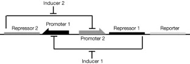
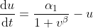
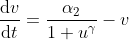

#### Construction of a genetic toggle switch in *Escherichia coli*

Toggle switch design

The behaviour of the toggle switch and the conditions for bistability can be understood using the following dimensionless model for the network:

*u* is the concentration of repressor 1  
*v* is the concentration of repressor 2  
α1 is the effective rate of synthesis of repressor 1  
α2 is the effective rate of synthesis of repressor 2  
β is the cooperativity of repression of promoter 2  
γ is the cooperativity of repression of promoter 1

A bistable toggle network with balanced promoter strengths.  

