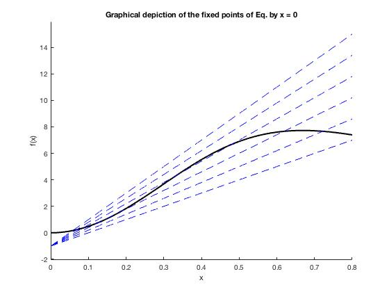

#### Noise-based switches and amplifiers for gene expression

A rate equation describing the evolution of the concentration of repressor

For this equation, there are two types of behavior. For one set of parameter values, we have monostability, whereby all initial concentrations evolve to the same fixed-point value. For another set, we have three fixed points, and the initial concentration will determine which steady state is selected. Additionally,

Graphical depiction of the fixed points of Eq. generated by setting   and plot  and the line . As the slope γ is increased, the system traverses a region of multistability and returns to a state of monostability.

