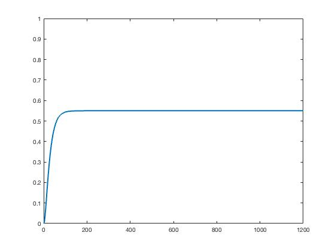
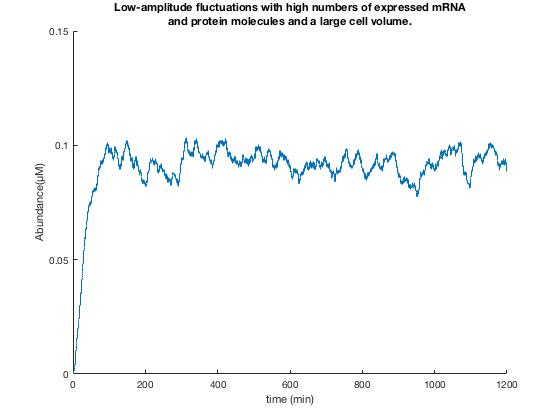
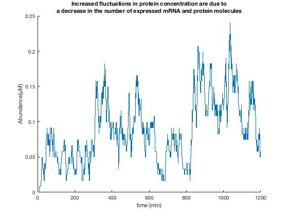
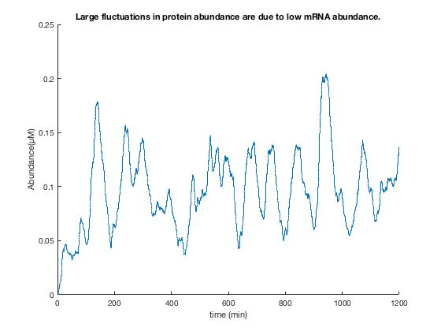

### Stochasticity in gene expression: from theories to phenotypes

M. Kaern, T. C. Elston, W. J. Blake, and J. J. Collins, 
“Stochasticity in gene expression: from theories to phenotypes.,” 
Nat. Rev. Genet., vol. 6, no. 6, pp. 451–464, 2005.

#### Deterministic rate equations

####Stochastic models
sA = 50;

sR = 5;

sP = 0.2;

δM = 0.1;

δP = 0.05; 

V = 200 μm3;(in units per min)

sA = 0.5;

sR = 0.05;

sP = 0.2;

δM = 0.1;

δP = 0.05; 

V = 2 μm3;(in units per min)

sA = 0.5;

sR = 0.05;

sP = 20;

δM = 0.1;

δP = 0.05; 

V = 200 μm3;(in units per min)

