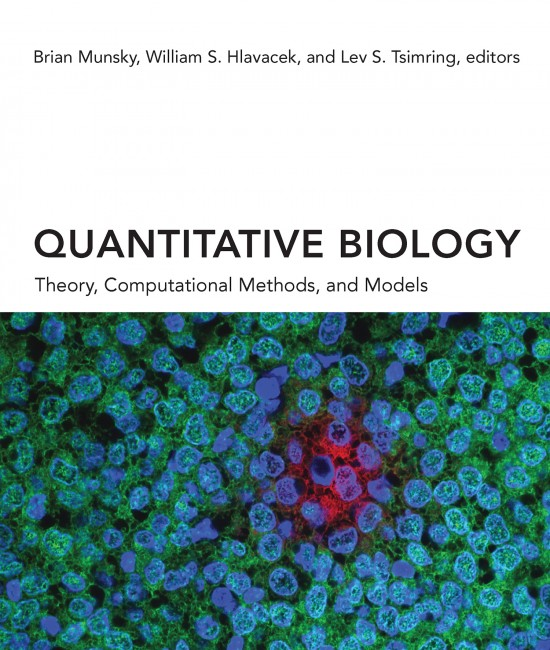

This folder has the scripts I wrote when reading the book [**Quantitative Biology**: Theory, Computational Methods, and Models] (https://mitpress.mit.edu/books/quantitative-biology) edited by *Brian Munsky*, *William S. Hlavacek* and *Lev S. Tsimring*. 

This is a comprehensive and the latest book related to quantitave biology. If you are just starting to enter into this field, I think this book would be a good place to start. It should carefully be read. 

There are also some codes attached with the book can be found [here](https://github.com/Munsky/qbio-Textbook.git). It is unfortunately that these codes are writen by various programming languages, such as python, mathlab, mathematica. 

I am trying to implement most of the codes by R during the leanring process. 