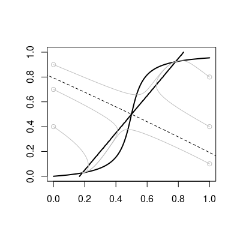

### Definition of the system
Reaction kinetic scheme (manually drawn by Inkscape according to the figure in the page 29 of the [book](https://mitpress.mit.edu/books/quantitative-biology).)

Ordinary differential equations in this system

### Vector field in the phase plane

### Nullclines and unstable manifold

The unstable manifold can be drawn by the R package [*phaseR*](https://cran.r-project.org/web/packages/phaseR/index.html). The vector filed and nullclines can also be analysis by this package. I put both of the implementation in the seperated scirpts. 

