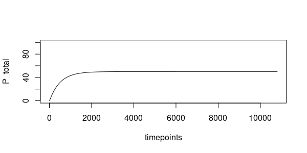
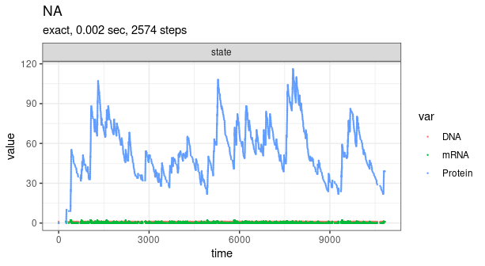

### Regulation of noise in the expression of a single gene

M. Kaern, T. C. Elston, W. J. Blake, and J. J. Collins, “Stochasticity in gene expression: from theories to phenotypes.,” Nat. Rev. Genet., vol. 6, no. 6, pp. 451–464, 2005.

deterministic models

simulation
two-stages model
DNA --k_R--> DNA + mRNA
mRNA --k_P--> mRNA + Protein
mRNA --γ_R--> 0
Protein --γ_R--> 0
