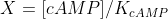
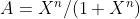
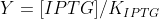
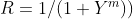
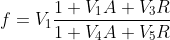
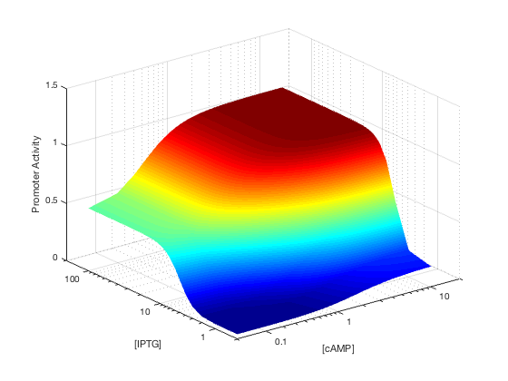
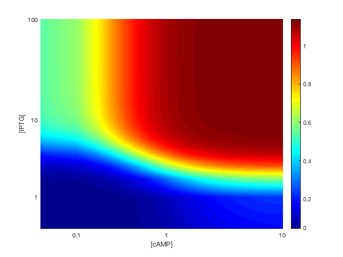
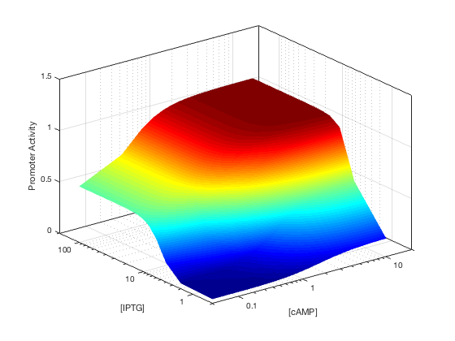
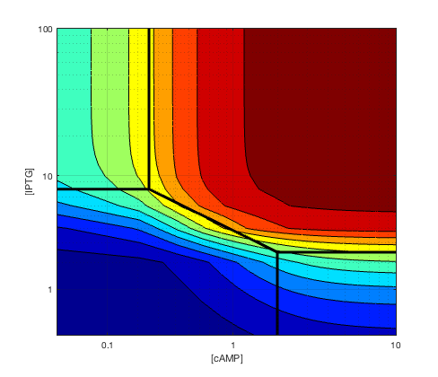

### Detailed map of a cis-regulatory input function
Y. Setty, A. E. Mayo, M. G. Surette, and U. Alon, “Detailed map of a cis-regulatory input function,” Proc. Natl. Acad. Sci. U. S. A., vol. 100, no. 13, pp. 7702–7707, Jun. 2003.

### cis regulatory input funciton

m = 4

n = 2

KcAMP = 1.8

KIPTG = 1.2

V1 = 3.5

V2 = 70

V3 = 170

V4 = 17

V5 = 540

after using `fit` funciton to smooth the data

Input function (promoter activity) in the mathematical model of the lac promoter.

Schematic form of the input function of the lac promoter.

